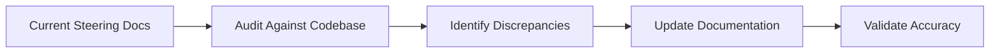

# Design Document: Steering Docs Update

## Overview

This design covers updating four steering documentation files to accurately reflect the current state of the Corgi Quest project. The steering docs are critical for Kiro's AI assistance quality - outdated docs lead to incorrect code suggestions and file placements.

**Files to update:**
1. `.kiro/steering/development-guidelines.md`
2. `.kiro/steering/structure.md`
3. `.kiro/steering/tech.md`
4. `.kiro/steering/product.md` (verify accuracy)

## Architecture

This is a documentation-only update with no code changes. The architecture involves:

1. **Audit Phase**: Compare each steering doc against actual codebase
2. **Update Phase**: Modify markdown files with accurate information
3. **Validation Phase**: Verify updated docs match reality

## Components and Interfaces

### Steering Files

| File | Purpose | Key Sections to Update |
|------|---------|----------------------|
| `development-guidelines.md` | Day-to-day coding rules | File paths, table count, screens, UI style |
| `structure.md` | Project organization | Directory tree, naming conventions, imports |
| `tech.md` | Technology stack | AI services, deployment, voice APIs |
| `product.md` | Product vision | Verify feature list is current |

### Update Strategy

Each file will be updated in place, preserving the existing structure while correcting outdated information.

## Data Models

No data model changes - this is documentation only.

## Correctness Properties

*A property is a characteristic or behavior that should hold true across all valid executions of a system-essentially, a formal statement about what the system should do. Properties serve as the bridge between human-readable specifications and machine-verifiable correctness guarantees.*

Since this is a documentation update feature, all acceptance criteria are example-based validations rather than universal properties. The criteria verify specific text content exists or doesn't exist in the steering files.

**No property-based tests are applicable** for this feature because:
- All requirements are about specific text content in specific files
- There's no generated/random input space to test against
- Validation is deterministic: either the correct text is present or it isn't

Manual verification checklist will be used instead of automated property tests.

## Error Handling

| Scenario | Handling |
|----------|----------|
| File doesn't exist | Create with correct content |
| Conflicting information | Prioritize actual codebase state |
| Unclear current state | Investigate codebase before documenting |

## Testing Strategy

### Validation Approach

Since this is documentation, testing involves manual verification:

1. **Path Validation**: Confirm documented paths exist in filesystem
2. **Table Count Validation**: Count tables in `convex/schema.ts` matches docs
3. **Screen Validation**: Confirm documented screens exist as routes
4. **Content Review**: Read through updated docs for accuracy

### Verification Checklist

After updates, verify:
- [ ] `src/routes/` path referenced (not `app/routes/`)
- [ ] `src/components/` path referenced (not `app/components/`)
- [ ] 18 tables documented
- [ ] All table names listed
- [ ] 10+ screens documented
- [ ] RPG theme mentioned (not "black and white only")
- [ ] Claude mentioned in AI services
- [ ] Netlify mentioned in deployment
- [ ] Component subfolders documented (dog/, layout/, training/, animations/, mood/)

No automated tests required for documentation updates.
